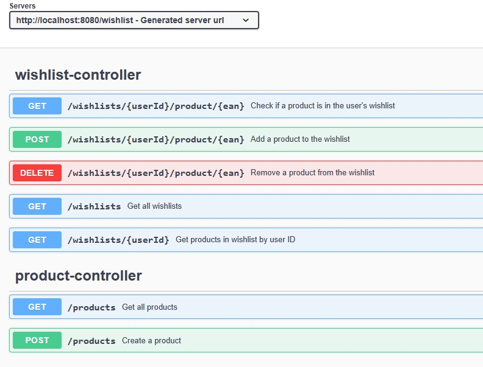
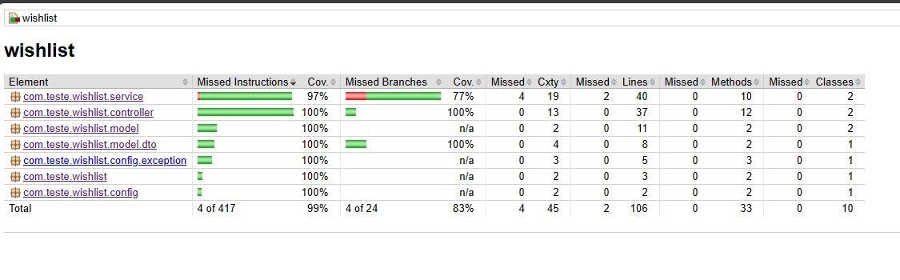
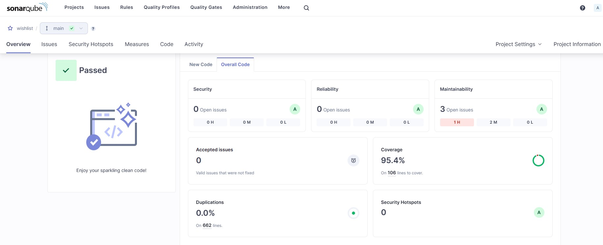

# WishList

Este projeto é uma aplicação para a criação e gerenciamento de listas de desejos, desenvolvida utilizando Java com o framework Spring Boot e o banco de dados MongoDB.

## Começando

Essas instruções ajudarão você a obter uma cópia do projeto em execução na sua máquina local para fins de desenvolvimento e teste.

### Construído com (pré-requisitos)

* [Java 17](https://www.oracle.com/java/technologies/javase-jdk17-downloads.html) - A linguagem de programação usada
* [Spring Boot 3.2.4](https://spring.io/projects/spring-boot) - O framework web usado
* [Maven](https://maven.apache.org/) - Gerenciamento de Dependência
* [JUnit](https://junit.org/junit5/) - Usado para testar
* [Mockito](https://site.mockito.org/) - Usado para criar objetos simulados em testes unitários
* [JaCoCo](https://www.jacoco.org/jacoco/) - Usado para medir a cobertura de testes
* [SonarQube](https://www.sonarqube.org/) - Usado para analisar a qualidade do código (Opcional*)
* [OpenAPI](https://swagger.io/specification/) - Usado para documentar as APIs via teste de contrato
* [Swagger](https://swagger.io/) - Usado para documentar as APIs via teste de contrato
* [MongoDB](https://www.mongodb.com/) - O banco de dados usado (Opcional*)
* [Docker](https://www.docker.com/) - Usado para empacotar o aplicativo
* [Postman](https://www.postman.com/) - Usado para testar as APIs (Opcional*)

###### Opcionais* - Não são necessários para executar o projeto.
###### - O SonarQube e o MongoDB podem ser executados via Docker.
###### - O Postman é opcional, pois você pode testar as APIs diretamente no navegador via swagger-ui.

### Instalação

Siga os passos abaixo para executar o projeto em sua máquina local usando o Docker.

1. Clone o repositório
   ```sh
   git clone https://github.com/teonasnetto/wishlist.git
    ```
2. Acesse a pasta do projeto
    ```sh
    cd wishlist
    ```
3. Execute o projeto
    ```sh
    docker-compose up
    ```

# Acessando a documentação da API

Após a execução do projeto, acesse o endereço [``http://localhost:8080/wishlist/swagger-ui/index.html``](http://localhost:8080/wishlist/swagger-ui/index.html) para acessar a documentação da API via Swagger.



## Executando os testes

Os testes são executados automaticamente durante a construção do projeto. O projeto utiliza openapi-generator para gerar as classes de modelo e os controladores a partir de um arquivo de especificação OpenAPI tornando o código orientado a testes.

Para executar os testes manualmente, execute o comando abaixo:

```sh
    mvn clean install
```

### Testes com JaCoCo
Após a execução dos testes tambem será gerado um relatório de cobertura de testes, que pode ser acessado no diretório ``target/site/jacoco/index.html`` como na imagem abaixo:



### Testes com SonarQube
Para executar os testes com o SonarQube, execute o comando abaixo:

<details>
<summary>Se você não tiver o SonarQube instalado</summary>

---

- Execute o comando abaixo para executar o SonarQube via Docker:
```sh
    docker run -d --name sonarqube -e SONAR_ES_BOOTSTRAP_CHECKS_DISABLE=true -p 9000:9000 sonarqube:latest
```

---

</details>


- Execute o comando abaixo para executar os testes com o SonarQube:
```sh
    mvn clean verify sonar:sonar -Dsonar.projectKey=PROJECT_KEY -Dsonar.projectName='PROJECT_NAME' -Dsonar.host.url=http://localhost:9000 -Dsonar.token=THE_GENERATED_TOKEN
```

Após a execução dos testes, acesse o endereço [``http://localhost:9000``](http://localhost:9000) e faça login com as credenciais ``admin:admin`` (você terá que alterar a senha na primeira vez que fizer login). Em seguida, acesse o projeto criado e veja o relatório de qualidade do código, como na imagem abaixo:



# Teste de integração CI/CD

O projeto está configurado para executar testes de integração CI/CD com o GitHub Actions. Acesse o arquivo [``.github/workflows/ci-cd.yml``](.github/workflows/ci-cd.yml) para ver a configuração.

### Processo de CI (Integração Contínua)
Ao fazer um push no repositório, o GitHub Actions irá executar o processo de CI, que consiste em:
- Compilar o projeto
- Executar os testes


## Autor

* **Teonas Netto** -  [teonasnetto](https://github.com/teonasnetto)

## Licença

Este projeto está licenciado sob a Licença MIT - veja o arquivo [LICENSE.md](LICENSE.md) para detalhes.